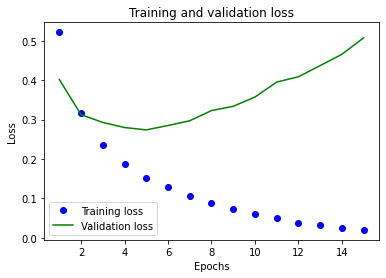
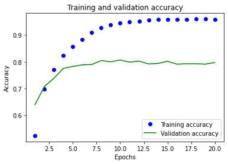
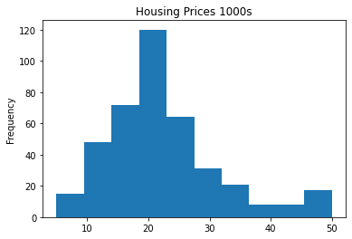

# Getting started with neural networks: Classification and regression

This part covers:
- First examples of real-world machine learning workflows
- Handling classification problems over vector data
- Handling continuous regression problems over vector data


This will be the fourth part of a series of posts for my own reference and continued professional development in deep learning. It should mostly follow important points taken from François Chollet's book Deep Learning with Python, Second Edition. 

The main book itself can be found at [Manning.com](https://livebook.manning.com/book/deep-learning-with-python-second-edition/chapter-1/)


```python
# conda create --name deep-learning
# conda activate deep-learning
# pip install tensorflow==2.6 keras==2.6
```

In this part, we'll be conducting three common use cases of neural networks:

1. Binary classification of movie reviews as positive or negative
2. Multi-class classification by classifying news wires by topic
3. Scalar data Estimating price of a house, given real-estate data

## Classifying movie reviews: A binary classification example

Binary classification is very common. 

### The IMDB dataset

- 50000 polarized reviews from the [Internet Movie Database](https://www.imdb.com/)
- 25K for training, 25K for testing, each half and half positive and negative
- Keras provides pre-processing of the reviews where:
    - Each review has been turned into a sequence of integers
    - Each integer stands for a specific word in a dictionary
    - train_data and test_data hold the reviews 
    - train_labels and test_labels will be 0s (negative) and 1s (positive)
  
- [Part 11] will show how to process raw text

**Loading the IMDB dataset**


```python
from tensorflow.keras.datasets import imdb
(train_data, train_labels), (test_data, test_labels) = imdb.load_data(
    num_words=10000) #discard any word not in the most common 10K words
```


```python
train_data[0]
len(train_data[0])
```


    218


```python
train_labels[0]
```


    1


```python
#our num_words was 10000 so our max index should be 9999
max([max(sequence) for sequence in train_data])
```


    9999


**Decoding reviews back to text**


```python
review = train_data[0]
word_index = imdb.get_word_index()
reverse_word_index = dict(
    [(value, key) for (key, value) in word_index.items()])
decoded_review = " ".join(
    [reverse_word_index.get(i - 3, "?") for i in review])
decoded_review
```


    "? this film was just brilliant casting location scenery story direction everyone's really suited the part they played and you could just imagine being there robert ? is an amazing actor and now the same being director ? father came from the same scottish island as myself so i loved the fact there was a real connection with this film the witty remarks throughout the film were great it was just brilliant so much that i bought the film as soon as it was released for ? and would recommend it to everyone to watch and the fly fishing was amazing really cried at the end it was so sad and you know what they say if you cry at a film it must have been good and this definitely was also ? to the two little boy's that played the ? of norman and paul they were just brilliant children are often left out of the ? list i think because the stars that play them all grown up are such a big profile for the whole film but these children are amazing and should be praised for what they have done don't you think the whole story was so lovely because it was true and was someone's life after all that was shared with us all"


### Preparing the data

We can't directly feed integers to the model. Neural nets expect contiguous batches of data and our reviews are of different lengths. There's two ways to handle this:

1. Pad lists so they're all the same length. They will end up as size `(samples, max_length)`. Then architect the model so the first layer takes integer tensors. (`Embedding` layer)

2. Multi-Hot encode lists which turns classes into binary columns for every class where there are as many columns as classes and fills the columns with 1's for if the word is present and 0 if not. For a sequence of [110, 34], this would create a 10,000 dimensional vector with 0s everywhere except indices 110 and 34 which would be ones. This could then be fed into a `Dense` layer which can handle floating point as the first layer. 

In our work, we'll go with the second option. 

**Encoding the integer sequences via multi-hot encoding**


```python
import numpy as np
def vectorize_sequences(sequences, dimension=10000):

    #create matrix of zeros with shape (len(sequences),dimension)
    results = np.zeros((len(sequences), dimension))
    for i, sequence in enumerate(sequences):
        for j in sequence:
            #sets specific indices of results[i] to 1s
            results[i, j] = 1.
    return results

#vectorized training data
x_train = vectorize_sequences(train_data)

#vectorized testing data
x_test = vectorize_sequences(test_data)
```


```python
x_train[0]
```


    array([0., 1., 1., ..., 0., 0., 0.])


```python
#We also need to vectorize our labels
y_train = np.asarray(train_labels).astype("float32")
y_test = np.asarray(test_labels).astype("float32")
```

### Building the model

This is about as simple as it gets. Binary classification, input is vectors and labels are scalers.  

A type of model that performs well on such a problem is a plain stack of densely connected (Dense) layers with `relu` activations.

Two decisions to be made for `Dense` layers:
1. How many layers
2. How many units for each layer

There are rules of thumb but for now, we'll use:

- Two intermediate layers with 16 units each
- Final layer with scaler prediction regarding sentiment

**Model definition**


```python
from tensorflow import keras
from tensorflow.keras import layers

model = keras.Sequential([
    layers.Dense(16, activation="relu"),
    layers.Dense(16, activation="relu"),
    layers.Dense(1, activation="sigmoid")
])
```

##### Model topology
Having 16 units gives `W` the shape (input, 16). This will project the input data into a 16-dimensional representation of space along with the bias and relu activation. Dimensionality can be interpreted as how much freedom the model has to represent the data in its hypothesis space. More units makes for richer representations but comes at higher computational cost, training time, and possibly overfitting. 

Relu activation function zeros out negative values:


Sigmoid compresses output to a range between 0 and 1


##### Loss Functions
The loss function should be `binary_crossentropy` since we're dealing with binary classification model and output is probability. We could have also chosen to use `mean_squared_error` but crossentropy is usually the best when dealing with models that output probabilities. 

Crossentropy is a quantity from information theory that measures the distance between probability distributions or, as it is here, the distance between the ground-truth distribution of predictions.

Remember from Part 2 that layers could only learn linear transformations and combinations of such operations if there were not activation functions. We need non-linearities to get a richer representation space. 

##### Optimizer
We'll use `rmsprop` which is a good first default choice. 


**Compiling the model**


```python
model.compile(optimizer="rmsprop",
              loss="binary_crossentropy",
              metrics=["accuracy"])
```

### Validating the approach

**Setting aside a validation set**


```python
x_validation = x_train[:10000]
x_training_half = x_train[10000:]
y_validation = y_train[:10000]
y_training_half = y_train[10000:]
```

**Training the model for 15 epochs**

Note at the end of each epoch, it will pause to calculate its loss and accuracy on the 10k validation samples. 


```python
history = model.fit(x_training_half,
                    y_training_half,
                    epochs=15,
                    batch_size=512,
                    validation_data=(x_validation, y_validation))
```

    Epoch 1/15
    30/30 [==============================] - 1s 34ms/step - loss: 0.5215 - accuracy: 0.7844 - val_loss: 0.4017 - val_accuracy: 0.8613
    Epoch 2/15
    30/30 [==============================] - ETA: 0s - loss: 0.3155 - accuracy: 0.90 - 1s 17ms/step - loss: 0.3154 - accuracy: 0.9034 - val_loss: 0.3123 - val_accuracy: 0.8872
    Epoch 3/15
    30/30 [==============================] - 0s 13ms/step - loss: 0.2346 - accuracy: 0.9259 - val_loss: 0.2926 - val_accuracy: 0.8861
    Epoch 4/15
    30/30 [==============================] - 0s 13ms/step - loss: 0.1863 - accuracy: 0.9400 - val_loss: 0.2796 - val_accuracy: 0.8875
    Epoch 5/15
    30/30 [==============================] - 0s 13ms/step - loss: 0.1506 - accuracy: 0.9547 - val_loss: 0.2736 - val_accuracy: 0.8906
    Epoch 6/15
    30/30 [==============================] - 0s 13ms/step - loss: 0.1278 - accuracy: 0.9602 - val_loss: 0.2848 - val_accuracy: 0.8881
    Epoch 7/15
    30/30 [==============================] - 0s 12ms/step - loss: 0.1053 - accuracy: 0.9693 - val_loss: 0.2968 - val_accuracy: 0.8867
    Epoch 8/15
    30/30 [==============================] - 0s 13ms/step - loss: 0.0889 - accuracy: 0.9749 - val_loss: 0.3227 - val_accuracy: 0.8798
    Epoch 9/15
    30/30 [==============================] - 0s 14ms/step - loss: 0.0741 - accuracy: 0.9797 - val_loss: 0.3335 - val_accuracy: 0.8831
    Epoch 10/15
    30/30 [==============================] - 0s 13ms/step - loss: 0.0604 - accuracy: 0.9849 - val_loss: 0.3570 - val_accuracy: 0.8794
    Epoch 11/15
    30/30 [==============================] - 0s 13ms/step - loss: 0.0495 - accuracy: 0.9887 - val_loss: 0.3950 - val_accuracy: 0.8726
    Epoch 12/15
    30/30 [==============================] - 0s 13ms/step - loss: 0.0383 - accuracy: 0.9921 - val_loss: 0.4085 - val_accuracy: 0.8774
    Epoch 13/15
    30/30 [==============================] - 0s 13ms/step - loss: 0.0333 - accuracy: 0.9932 - val_loss: 0.4369 - val_accuracy: 0.8752
    Epoch 14/15
    30/30 [==============================] - 0s 13ms/step - loss: 0.0247 - accuracy: 0.9967 - val_loss: 0.4655 - val_accuracy: 0.8763
    Epoch 15/15
    30/30 [==============================] - 0s 12ms/step - loss: 0.0197 - accuracy: 0.9971 - val_loss: 0.5074 - val_accuracy: 0.8729
    


```python
history_dict = history.history
history_dict.keys()
```


    dict_keys(['loss', 'accuracy', 'val_loss', 'val_accuracy'])


Let's look deeper at this history

**Plotting the training and validation loss**


```python
import matplotlib.pyplot as plt
history_dict = history.history
loss_values = history_dict["loss"]
val_loss_values = history_dict["val_loss"]
epochs = range(1, len(loss_values) + 1)
plt.plot(epochs, loss_values, "bo", label="Training loss")
plt.plot(epochs, val_loss_values, "g", label="Validation loss")
plt.title("Training and validation loss")
plt.xlabel("Epochs")
plt.ylabel("Loss")
plt.legend()
plt.show()
```


    

    


**Plotting the training and validation accuracy**


```python
plt.clf()
acc = history_dict["accuracy"]
val_acc = history_dict["val_accuracy"]
plt.plot(epochs, acc, "bo", label="Training acc")
plt.plot(epochs, val_acc, "g", label="Validation acc")
plt.title("Training and validation accuracy")
plt.xlabel("Epochs")
plt.ylabel("Accuracy")
plt.legend()
plt.show()
```


    

    


Training loss decreases with each epoch but the validation data is getting worse and worse. It's overfitting and over-optimizing for the training data. 

We could stop training after 4 epochs when the difference between validation and training has started diverging but there are other methods to prevent this which will be in the next part. 

**Retraining a model from scratch**


```python
model = keras.Sequential([
    layers.Dense(16, activation="relu"),
    layers.Dense(16, activation="relu"),
    layers.Dense(1, activation="sigmoid")
])
model.compile(optimizer="rmsprop",
              loss="binary_crossentropy",
              metrics=["accuracy"])
model.fit(x_train, y_train, epochs=4, batch_size=512)
results = model.evaluate(x_test, y_test)
```

    Epoch 1/4
    49/49 [==============================] - 1s 11ms/step - loss: 0.4654 - accuracy: 0.8100
    Epoch 2/4
    49/49 [==============================] - 0s 9ms/step - loss: 0.2659 - accuracy: 0.9098
    Epoch 3/4
    49/49 [==============================] - 0s 9ms/step - loss: 0.2049 - accuracy: 0.9263
    Epoch 4/4
    49/49 [==============================] - 0s 9ms/step - loss: 0.1712 - accuracy: 0.9388
    782/782 [==============================] - 1s 1ms/step - loss: 0.2964 - accuracy: 0.8823: 0s - loss: 0.302
    


```python
results
```


    [0.29640674591064453, 0.8822799921035767]


This is an over-simplistic method of reducing overfitting but it gives us 88% accuracy!

Current benchmarks on this data set are in the 94-95% range. 


### Using a trained model to generate predictions on new data

The closer the model predicts to 0.5, the less confident it is about it's answers. 


```python
model.predict(x_test)
```


    array([[0.24495971],
           [0.99995434],
           [0.9513168 ],
           ...,
           [0.14651951],
           [0.10635179],
           [0.6919943 ]], dtype=float32)


### Further experiments

There's a lot of different aspects we could apply to the above- I've attached my results for each different version:

- Number of layers
    1. 0.283; 88.66% accuracy
    2. 0.285; 88.78%
    3. 0.311 Loss; 87.98% 

- Number of units per layer

    - 16: 0.285; 88.78%
    - 32: 0.340; 88.01%
    - 64: 0.331; 87.69%

- mse loss functions instead of binary_cross_entropy
    - binary_cross_entropy: 0.285; 88.78%
    - mse: 0.0867; 88.25%

- use tanh activation function vs relu
    - relu: 0.285; 88.78%
    - tanh: 0.328; 87.44%
    


### Wrapping up

- Normally, one has to do a lot of preprocessing of data to feed a neural net
- Stacks of `Dense` and `relu` can solve a lot of problems
- In binary classification, the final layer should have one output with a sigmoid activation function.
- With this format, use the `binary_crossentropy` loss function
- rmsprop is a good optimizer
- overfitting will eventually end up with worse results on data they haven't seen. Monitor the performance of validation data. 

## Classifying news articles: A multiclass classification problem

- How to handle when you have more than two classes.

- In this project, we'll take Reuters news articles and classify them into 46 topics. Each article will only have one label associated with it so it's a single-label multiclass classification problem. If we were using multiple labels per item, then it would be a multilabel multiclass classification problem.

### The Reuters dataseta

- We're using the Reuters dataset, which contains short newswires and their topics from 1986. It's commonly used for text classification. Each label has at least 10 examples in the training set but not all labels have the same number represented in the dataset. 

**Loading the Reuters dataset**


```python
from tensorflow.keras.datasets import reuters
(train_data, train_labels), (test_data, test_labels) = reuters.load_data(
    path='reuters.npz', num_words=10000, skip_top=0, maxlen=None,
    test_split=0.2, seed=113, start_char=1, oov_char=2, index_from=0)
```


```python
len(train_data)
```


    8982


```python
len(test_data)
```


    2246


```python
train_data[10]
```


    [1,
     242,
     270,
     204,
     153,
     50,
     71,
     157,
     23,
     11,
     43,
     293,
     23,
     36,
     71,
     2976,
     3551,
     11,
     43,
     4686,
     4326,
     83,
     58,
     3496,
     4792,
     11,
     58,
     448,
     4326,
     14,
     9]


**Decoding newswires back to text**


```python
word_index = reuters.get_word_index()
reverse_word_index = dict([(value, key) for (key, value) in word_index.items()])
decoded_newswire = " ".join([reverse_word_index.get(i, "?") for i in
    train_data[0]])
decoded_newswire
```


    'the of of said as a result of its december acquisition of space co it expects earnings per share in 1987 of 1 15 to 1 30 dlrs per share up from 70 cts in 1986 the company said pretax net should rise to nine to 10 mln dlrs from six mln dlrs in 1986 and rental operation revenues to 19 to 22 mln dlrs from 12 5 mln dlrs it said cash flow per share this year should be 2 50 to three dlrs reuter 3'


```python
#label index 
train_labels[10]
```


    3


### Preparing the data

**Encoding the input data**


```python
#We use multi-hot encoding for encoding the input data
x_train = vectorize_sequences(train_data)
x_test = vectorize_sequences(test_data)
print(train_data.shape, x_train.shape)
```

    (8982,) (8982, 10000)
    

**Encoding the labels**

Similar to multi-hot encoding, we'll use one-hot encoding, commonly used for categorical data and embeds each label as an all-zero vector with a 1 in the place of the label index.

We'll do this the manual way, as well as with the built-in Keras function. 


```python
def to_one_hot(labels, dimension=46):
    results = np.zeros((len(labels), dimension))
    for i, label in enumerate(labels):
        results[i, label] = 1.
    return results
y_train = to_one_hot(train_labels)
y_test = to_one_hot(test_labels)
```


```python
from tensorflow.keras.utils import to_categorical
y_train = to_categorical(train_labels)
y_test = to_categorical(test_labels)
```

### Building the model

When creating a binary classification model, we'd used dense layers with 16 units. One of the balancing acts required for ML is between letting too much information through and resulting in overfitting vs. losing information in the bottleneck of layers that don't have the capability to represent the data properly. Since this is a multi-class problem instead of binary, we'll increase the number of units to 64 with a final output of 46 for the 46 separate classes. 

For our losses, we'll use `categorical_crossentropy` which measures the distance between two probability distributions, in our case the distribution of predicted and correct labels. 

**Model definition**


```python
model = keras.Sequential([
    layers.Dense(64, activation="relu"),
    layers.Dense(64, activation="relu"),
    layers.Dense(46, activation="softmax")
])
```

**Compiling the model**


```python
model.compile(optimizer="rmsprop",
              loss="categorical_crossentropy",
              metrics=["accuracy"])
```

### Validating predictions

**Setting aside a validation set**


```python
x_validation = x_train[:1500]
x_training_partial = x_train[1500:]
y_validation = y_train[:1500]
y_training_partial = y_train[1500:]
```

**Training the model**


```python
history = model.fit(x_training_partial,
                    y_training_partial,
                    epochs=20,
                    batch_size=512,
                    validation_data=(x_validation, y_validation))
```

    Epoch 1/20
    15/15 [==============================] - 1s 30ms/step - loss: 2.6295 - accuracy: 0.5237 - val_loss: 1.7866 - val_accuracy: 0.6400
    Epoch 2/20
    15/15 [==============================] - 0s 18ms/step - loss: 1.4396 - accuracy: 0.6981 - val_loss: 1.3976 - val_accuracy: 0.7080
    Epoch 3/20
    15/15 [==============================] - 0s 17ms/step - loss: 1.0716 - accuracy: 0.7719 - val_loss: 1.2264 - val_accuracy: 0.7387
    Epoch 4/20
    15/15 [==============================] - 0s 17ms/step - loss: 0.8487 - accuracy: 0.8236 - val_loss: 1.1216 - val_accuracy: 0.7753
    Epoch 5/20
    15/15 [==============================] - 0s 17ms/step - loss: 0.6777 - accuracy: 0.8566 - val_loss: 1.0700 - val_accuracy: 0.7827
    Epoch 6/20
    15/15 [==============================] - 0s 18ms/step - loss: 0.5428 - accuracy: 0.8839 - val_loss: 1.0264 - val_accuracy: 0.7887
    Epoch 7/20
    15/15 [==============================] - 0s 18ms/step - loss: 0.4353 - accuracy: 0.9096 - val_loss: 0.9989 - val_accuracy: 0.7900
    Epoch 8/20
    15/15 [==============================] - 0s 18ms/step - loss: 0.3516 - accuracy: 0.9270 - val_loss: 0.9774 - val_accuracy: 0.8047
    Epoch 9/20
    15/15 [==============================] - 0s 18ms/step - loss: 0.2889 - accuracy: 0.9377 - val_loss: 0.9855 - val_accuracy: 0.8000
    Epoch 10/20
    15/15 [==============================] - 0s 17ms/step - loss: 0.2429 - accuracy: 0.9463 - val_loss: 1.0014 - val_accuracy: 0.8067
    Epoch 11/20
    15/15 [==============================] - 0s 17ms/step - loss: 0.2061 - accuracy: 0.9499 - val_loss: 1.0467 - val_accuracy: 0.7987
    Epoch 12/20
    15/15 [==============================] - 0s 17ms/step - loss: 0.1820 - accuracy: 0.9519 - val_loss: 1.0093 - val_accuracy: 0.8027
    Epoch 13/20
    15/15 [==============================] - 0s 17ms/step - loss: 0.1585 - accuracy: 0.9567 - val_loss: 1.0593 - val_accuracy: 0.7920
    Epoch 14/20
    15/15 [==============================] - 0s 16ms/step - loss: 0.1463 - accuracy: 0.9579 - val_loss: 1.0646 - val_accuracy: 0.7940
    Epoch 15/20
    15/15 [==============================] - 0s 16ms/step - loss: 0.1371 - accuracy: 0.9575 - val_loss: 1.0525 - val_accuracy: 0.8020
    Epoch 16/20
    15/15 [==============================] - 0s 16ms/step - loss: 0.1237 - accuracy: 0.9586 - val_loss: 1.1165 - val_accuracy: 0.7913
    Epoch 17/20
    15/15 [==============================] - 0s 16ms/step - loss: 0.1226 - accuracy: 0.9582 - val_loss: 1.1144 - val_accuracy: 0.7927
    Epoch 18/20
    15/15 [==============================] - 0s 16ms/step - loss: 0.1155 - accuracy: 0.9598 - val_loss: 1.1397 - val_accuracy: 0.7927
    Epoch 19/20
    15/15 [==============================] - 0s 16ms/step - loss: 0.1119 - accuracy: 0.9602 - val_loss: 1.1784 - val_accuracy: 0.7913
    Epoch 20/20
    15/15 [==============================] - 0s 16ms/step - loss: 0.1084 - accuracy: 0.9592 - val_loss: 1.1603 - val_accuracy: 0.7973
    

**Plotting the training and validation loss**


```python
loss = history.history["loss"]
val_loss = history.history["val_loss"]
epochs = range(1, len(loss) + 1)
plt.plot(epochs, loss, "bo", label="Training loss")
plt.plot(epochs, val_loss, "g", label="Validation loss")
plt.title("Training and validation loss")
plt.xlabel("Epochs")
plt.ylabel("Loss")
plt.legend()
plt.show()
```


    

    


**Plotting the training and validation accuracy**


```python
plt.clf()
acc = history.history["accuracy"]
val_acc = history.history["val_accuracy"]
plt.plot(epochs, acc, "bo", label="Training accuracy")
plt.plot(epochs, val_acc, "g", label="Validation accuracy")
plt.title("Training and validation accuracy")
plt.xlabel("Epochs")
plt.ylabel("Accuracy")
plt.legend()
plt.show()
```


    

    


**Retraining a model from scratch**

The model overfits after nine epochs - validation accuracy and losses stabilize or get worse after this point. We'll re-initialize the model with 9 epochs. 


```python
model = keras.Sequential([
  layers.Dense(64, activation="relu"),
  layers.Dense(64, activation="relu"),
  layers.Dense(46, activation="softmax")
])
model.compile(optimizer="rmsprop",
              loss="categorical_crossentropy",
              metrics=["accuracy"])
model.fit(x_train,
          y_train,
          epochs=9,
          batch_size=512)
results = model.evaluate(x_test, y_test)
```

    Epoch 1/9
    18/18 [==============================] - 1s 14ms/step - loss: 2.4233 - accuracy: 0.5410
    Epoch 2/9
    18/18 [==============================] - 0s 14ms/step - loss: 1.3332 - accuracy: 0.7138
    Epoch 3/9
    18/18 [==============================] - 0s 15ms/step - loss: 0.9945 - accuracy: 0.7875
    Epoch 4/9
    18/18 [==============================] - 0s 14ms/step - loss: 0.7805 - accuracy: 0.8328
    Epoch 5/9
    18/18 [==============================] - 0s 14ms/step - loss: 0.6131 - accuracy: 0.8713
    Epoch 6/9
    18/18 [==============================] - 0s 14ms/step - loss: 0.4886 - accuracy: 0.9011
    Epoch 7/9
    18/18 [==============================] - 0s 14ms/step - loss: 0.3944 - accuracy: 0.9178
    Epoch 8/9
    18/18 [==============================] - 0s 14ms/step - loss: 0.3189 - accuracy: 0.9305
    Epoch 9/9
    18/18 [==============================] - 0s 14ms/step - loss: 0.2694 - accuracy: 0.9395
    71/71 [==============================] - 0s 2ms/step - loss: 0.9445 - accuracy: 0.7916
    


```python
results
```


    [0.9444747567176819, 0.7916295528411865]


Accuracy of 79%! If we were to implement a random classifier, even with this uneven dataset, we'd get a much lower number - more like ~20%. 


```python
import copy
test_labels_copy = copy.copy(test_labels)
np.random.shuffle(test_labels_copy)
hits_array = np.array(test_labels) == np.array(test_labels_copy)
hits_array.mean()
```


    0.188780053428317


### Generating predictions on new data

We can now use our model to predict new data, we'll use our test data we set aside earlier:


```python
predictions = model.predict(x_test)
```


```python
predictions[-1].shape
```


    (46,)


```python
np.sum(predictions[-1])
#sums to 1 since this is a probability distribution
```


    0.9999999


```python
decoded_newswire = " ".join([reverse_word_index.get(i, "?") for i in
    test_data[-1]])
decoded_newswire
```


    "the congress should give the u s agriculture secretary the authority to keep the 1987 soybean loan rate at the current effective rate of 4 56 dlrs per bushel in order to help resolve the problem of soybean export competitiveness usda undersecretary dan amstutz said speaking to reporters following a senate agriculture appropriations hearing amstutz suggested that one way out of the current soybean program dilemma would be for congress to allow the loan rate to remain at 4 56 dlrs he indicated if the loan rate were 4 56 dlrs usda could then consider ways to make u s soybeans more competitive such as using certificates to further of the loan rate under current law the 1987 soybean loan rate cannot be less than 4 77 dlrs per bu of suggestion would be for congress to change the farm bill to allow usda to leave the soybean loan rate at 4 56 dlrs in crop year 1987 rather than increase it to 4 77 dlrs the 1986 effective loan rate is 4 56 dlrs because of the 4 3 pct gramm rudman budget cut amstutz stressed that a major factor in any decision on soybean program changes will be the budget costs he told the hearing that the problem in soybeans is that the u s loan rate provides an umbrella to foreign production and causes competitive problems for u s soybeans asked about the american soybean association's request for some form of income support amstutz said the competitive problem is the most severe he said usda is still studying the situation and no resolution has yet been found reuter 3"


```python
np.argmax(predictions[-1])
```


    1


Based on the categories from the original dataset, we can withdraw the associated label.


```python
#Original dictionary
reuters_label_dict = {'copper': 6, 'livestock': 28, 'gold': 25, 'money-fx': 19, 'ipi': 30, 'trade': 11, 'cocoa': 0, 'iron-steel': 31, 'reserves': 12, 'tin': 26, 'zinc': 37, 'jobs': 34, 'ship': 13, 'cotton': 14, 'alum': 23, 'strategic-metal': 27, 'lead': 45, 'housing': 7, 'meal-feed': 22, 'gnp': 21, 'sugar': 10, 'rubber': 32, 'dlr': 40, 'veg-oil': 2, 'interest': 20, 'crude': 16, 'coffee': 9, 'wheat': 5, 'carcass': 15, 'lei': 35, 'gas': 41, 'nat-gas': 17, 'oilseed': 24, 'orange': 38, 'heat': 33, 'wpi': 43, 'silver': 42, 'cpi': 18, 'earn': 3, 'bop': 36, 'money-supply': 8, 'hog': 44, 'acq': 4, 'pet-chem': 39, 'grain': 1, 'retail': 29}

#reverse the dictionary
reuters_label_reversed = {v:k for k, v in reuters_label_dict.items()}
reuters_label_reversed[24]
```


    'oilseed'


This is correct! Soybeans was the main topic of the sample and makes up 90% of the US oilseed production along with peanuts, sunflower seeds, canola and flax. 

### Another method to handle the labels and the loss

Instead of using the single-hot encoding, we could also express the labels as an integer tensor:

This would be valid but we'd need to use a different loss function called `sparse_categorical_crossentropy`. Our previous loss function of `categorical_crossentropy` expects categorical encoding but we can use the integer tensor format with `sparse_categorical_crossentropy`. Mathematically, it behaves identically to the first. We used this loss function when we were predicting the MNIST dataset. 


```python
y_train = np.array(train_labels)
y_test = np.array(test_labels)

model.compile(optimizer="rmsprop",
              loss="sparse_categorical_crossentropy",
              metrics=["accuracy"])
```

### The importance of having sufficiently large intermediate layers

A rule of thumb is to never have fewer units in the intermediate layer than the final output. We talked about how this can create an information bottleneck that can't be pushed through the smaller representation space allowed by lower dimensionality. We can demonstrate this by having the same structure but changing one layer to having four units and observing the results. 

**A model with an information bottleneck**


```python
model = keras.Sequential([
    layers.Dense(64, activation="relu"),
    layers.Dense(4, activation="relu"),
    layers.Dense(46, activation="softmax")
])
model.compile(optimizer="rmsprop",
              loss="categorical_crossentropy",
              metrics=["accuracy"])
model.fit(x_training_partial,
          y_training_partial,
          epochs=20,
          batch_size=128,
          validation_data=(x_validation, y_validation))
```

    Epoch 1/20
    59/59 [==============================] - 1s 10ms/step - loss: 3.0991 - accuracy: 0.2989 - val_loss: 2.4454 - val_accuracy: 0.5640
    Epoch 2/20
    59/59 [==============================] - 1s 9ms/step - loss: 1.9205 - accuracy: 0.5849 - val_loss: 1.7296 - val_accuracy: 0.5853
    Epoch 3/20
    59/59 [==============================] - 0s 8ms/step - loss: 1.4691 - accuracy: 0.6111 - val_loss: 1.5840 - val_accuracy: 0.6147
    Epoch 4/20
    59/59 [==============================] - 1s 9ms/step - loss: 1.3077 - accuracy: 0.6423 - val_loss: 1.5334 - val_accuracy: 0.6307
    Epoch 5/20
    59/59 [==============================] - 1s 9ms/step - loss: 1.1996 - accuracy: 0.6743 - val_loss: 1.5245 - val_accuracy: 0.6393
    Epoch 6/20
    59/59 [==============================] - 1s 15ms/step - loss: 1.1142 - accuracy: 0.6879 - val_loss: 1.5083 - val_accuracy: 0.6373
    Epoch 7/20
    59/59 [==============================] - 1s 9ms/step - loss: 1.0411 - accuracy: 0.7138 - val_loss: 1.5123 - val_accuracy: 0.6647
    Epoch 8/20
    59/59 [==============================] - 1s 9ms/step - loss: 0.9810 - accuracy: 0.7283 - val_loss: 1.5209 - val_accuracy: 0.6647
    Epoch 9/20
    59/59 [==============================] - 1s 9ms/step - loss: 0.9295 - accuracy: 0.7339 - val_loss: 1.5905 - val_accuracy: 0.6673
    Epoch 10/20
    59/59 [==============================] - 1s 9ms/step - loss: 0.8854 - accuracy: 0.7406 - val_loss: 1.6056 - val_accuracy: 0.6687
    Epoch 11/20
    59/59 [==============================] - 1s 9ms/step - loss: 0.8482 - accuracy: 0.7493 - val_loss: 1.6305 - val_accuracy: 0.6633
    Epoch 12/20
    59/59 [==============================] - 1s 9ms/step - loss: 0.8148 - accuracy: 0.7577 - val_loss: 1.6903 - val_accuracy: 0.6647
    Epoch 13/20
    59/59 [==============================] - 1s 9ms/step - loss: 0.7837 - accuracy: 0.7653 - val_loss: 1.7595 - val_accuracy: 0.6647
    Epoch 14/20
    59/59 [==============================] - 1s 9ms/step - loss: 0.7554 - accuracy: 0.7737 - val_loss: 1.8189 - val_accuracy: 0.6680
    Epoch 15/20
    59/59 [==============================] - 1s 9ms/step - loss: 0.7304 - accuracy: 0.7817 - val_loss: 1.8603 - val_accuracy: 0.6613
    Epoch 16/20
    59/59 [==============================] - 0s 8ms/step - loss: 0.7076 - accuracy: 0.7829 - val_loss: 1.8854 - val_accuracy: 0.6580
    Epoch 17/20
    59/59 [==============================] - 0s 8ms/step - loss: 0.6888 - accuracy: 0.7875 - val_loss: 2.0270 - val_accuracy: 0.6640
    Epoch 18/20
    59/59 [==============================] - 0s 8ms/step - loss: 0.6673 - accuracy: 0.7926 - val_loss: 2.0110 - val_accuracy: 0.6627
    Epoch 19/20
    59/59 [==============================] - 0s 8ms/step - loss: 0.6527 - accuracy: 0.8003 - val_loss: 2.1027 - val_accuracy: 0.6587
    Epoch 20/20
    59/59 [==============================] - 0s 8ms/step - loss: 0.6355 - accuracy: 0.8095 - val_loss: 2.1728 - val_accuracy: 0.6587
    


    <keras.callbacks.History at 0x20039007430>


Our information bottleneck now gives a much lower validation accuracy score of ~70%. The model is able to still compress a lot of information but not all of it. 

### Further experiments

Some alternate setups and associated metrics that resulted:

- Number of units: 32, 64, 128, or 256

- Number of layers of intermediate layers: 1, 2, 3, or 4


### Wrapping up

- To classify data points among N classes, should end with a Dense layer of size N
- In single-label, multiclass classification problems, the final layer should have a `softmax` activation with an output of a probability distribution over the class possibilities
- Use `categorical_crossentropy` or its sparse version. 
    - normal categorical uses one-hot encoding
    - sparse uses labels as integers
- Avoid creating information bottlenecks with small intermediate layers


## Predicting house prices: A regression problem

> Quick note: Regression predicts a value instead of a label. The logistic regression algorithm sounds remarkably similar to linear regression but logistic regression is a classification algorithm. Very confusing. 

This problem will predict housing prices based on the characteristics of houses from Boston. Whereas before in classification problems, we were predicting labels, in regression, we have to predict specific values. Sometimes, regression problems can be simplified to classification problems by bucketing ranges of values into bins and predicting bins but we won't be performing that here. 

### The Boston Housing Price dataset

- This dataset contains Boston home prices from the 1970s. It has information about the home itself along with aspects of the neighborhood. It's a relatively small dataset with 506 total samples, 404 in training, 102 for testing. Each of the features also has a different scale, some may be proportions, while others are absolute values. [Carnegie Mellon]() maintains the dataset and the attributes contain the following variables:

- CRIM     per capita crime rate by town
- ZN       proportion of residential land zoned for lots over 25,000 sq.ft.
- INDUS    proportion of non-retail business acres per town
- CHAS     Charles River dummy variable (= 1 if tract bounds river; 0 otherwise)
- NOX      nitric oxides concentration (parts per 10 million)
- RM       average number of rooms per dwelling
- AGE      proportion of owner-occupied units built prior to 1940
- DIS      weighted distances to five Boston employment centres
- RAD      index of accessibility to radial highways
- TAX      full-value property-tax rate per \\$10,000
- PTRATIO  pupil-teacher ratio by town
- B        1000(Bk - 0.63)^2 where Bk is the proportion of blacks by town
- LSTAT    % lower status of the population
- MEDV     Median value of owner-occupied homes in \\$1000's

**Loading the Boston housing dataset**


```python
from tensorflow.keras.datasets import boston_housing
(train_data, train_targets), (test_data, test_targets) = boston_housing.load_data()
```


```python
train_data.shape
```


    (404, 13)


```python
test_data.shape
```


    (102, 13)


```python
train_targets
```


    array([15.2, 42.3, 50. , 21.1, 17.7, 18.5, 11.3, 15.6, 15.6, 14.4, 12.1,
           17.9, 23.1, 19.9, 15.7,  8.8, 50. , 22.5, 24.1, 27.5, 10.9, 30.8,
           32.9, 24. , 18.5, 13.3, 22.9, 34.7, 16.6, 17.5, 22.3, 16.1, 14.9,
           23.1, 34.9, 25. , 13.9, 13.1, 20.4, 20. , 15.2, 24.7, 22.2, 16.7,
           12.7, 15.6, 18.4, 21. , 30.1, 15.1, 18.7,  9.6, 31.5, 24.8, 19.1,
           22. , 14.5, 11. , 32. , 29.4, 20.3, 24.4, 14.6, 19.5, 14.1, 14.3,
           15.6, 10.5,  6.3, 19.3, 19.3, 13.4, 36.4, 17.8, 13.5, 16.5,  8.3,
           14.3, 16. , 13.4, 28.6, 43.5, 20.2, 22. , 23. , 20.7, 12.5, 48.5,
           14.6, 13.4, 23.7, 50. , 21.7, 39.8, 38.7, 22.2, 34.9, 22.5, 31.1,
           28.7, 46. , 41.7, 21. , 26.6, 15. , 24.4, 13.3, 21.2, 11.7, 21.7,
           19.4, 50. , 22.8, 19.7, 24.7, 36.2, 14.2, 18.9, 18.3, 20.6, 24.6,
           18.2,  8.7, 44. , 10.4, 13.2, 21.2, 37. , 30.7, 22.9, 20. , 19.3,
           31.7, 32. , 23.1, 18.8, 10.9, 50. , 19.6,  5. , 14.4, 19.8, 13.8,
           19.6, 23.9, 24.5, 25. , 19.9, 17.2, 24.6, 13.5, 26.6, 21.4, 11.9,
           22.6, 19.6,  8.5, 23.7, 23.1, 22.4, 20.5, 23.6, 18.4, 35.2, 23.1,
           27.9, 20.6, 23.7, 28. , 13.6, 27.1, 23.6, 20.6, 18.2, 21.7, 17.1,
            8.4, 25.3, 13.8, 22.2, 18.4, 20.7, 31.6, 30.5, 20.3,  8.8, 19.2,
           19.4, 23.1, 23. , 14.8, 48.8, 22.6, 33.4, 21.1, 13.6, 32.2, 13.1,
           23.4, 18.9, 23.9, 11.8, 23.3, 22.8, 19.6, 16.7, 13.4, 22.2, 20.4,
           21.8, 26.4, 14.9, 24.1, 23.8, 12.3, 29.1, 21. , 19.5, 23.3, 23.8,
           17.8, 11.5, 21.7, 19.9, 25. , 33.4, 28.5, 21.4, 24.3, 27.5, 33.1,
           16.2, 23.3, 48.3, 22.9, 22.8, 13.1, 12.7, 22.6, 15. , 15.3, 10.5,
           24. , 18.5, 21.7, 19.5, 33.2, 23.2,  5. , 19.1, 12.7, 22.3, 10.2,
           13.9, 16.3, 17. , 20.1, 29.9, 17.2, 37.3, 45.4, 17.8, 23.2, 29. ,
           22. , 18. , 17.4, 34.6, 20.1, 25. , 15.6, 24.8, 28.2, 21.2, 21.4,
           23.8, 31. , 26.2, 17.4, 37.9, 17.5, 20. ,  8.3, 23.9,  8.4, 13.8,
            7.2, 11.7, 17.1, 21.6, 50. , 16.1, 20.4, 20.6, 21.4, 20.6, 36.5,
            8.5, 24.8, 10.8, 21.9, 17.3, 18.9, 36.2, 14.9, 18.2, 33.3, 21.8,
           19.7, 31.6, 24.8, 19.4, 22.8,  7.5, 44.8, 16.8, 18.7, 50. , 50. ,
           19.5, 20.1, 50. , 17.2, 20.8, 19.3, 41.3, 20.4, 20.5, 13.8, 16.5,
           23.9, 20.6, 31.5, 23.3, 16.8, 14. , 33.8, 36.1, 12.8, 18.3, 18.7,
           19.1, 29. , 30.1, 50. , 50. , 22. , 11.9, 37.6, 50. , 22.7, 20.8,
           23.5, 27.9, 50. , 19.3, 23.9, 22.6, 15.2, 21.7, 19.2, 43.8, 20.3,
           33.2, 19.9, 22.5, 32.7, 22. , 17.1, 19. , 15. , 16.1, 25.1, 23.7,
           28.7, 37.2, 22.6, 16.4, 25. , 29.8, 22.1, 17.4, 18.1, 30.3, 17.5,
           24.7, 12.6, 26.5, 28.7, 13.3, 10.4, 24.4, 23. , 20. , 17.8,  7. ,
           11.8, 24.4, 13.8, 19.4, 25.2, 19.4, 19.4, 29.1])


```python
plt.hist(train_targets, bins=10)
plt.gca().set(title='Housing Prices 1000s', ylabel='Frequency');
```


    

    


Most of the houses are \\$10000 to \\$50000 with the greatest number around 20K. These prices are again, from the mid-70's and not adjusted for inflation. 

### Preparing the data

To handle all the different ranges of the variables, we'll normalize the information by first subtracting the mean and dividing by the normal deviation. This has the effect of all the distributions of the data re-centering to a standard normal distribution centered on 0 with a deviation of 1. This helps any variable that is larger, smaller, or skewed, to not play an outsized or minimal role in affecting the error of the regression model simply because of the size of its magnitude. 

**Normalizing the data**


```python
mean = train_data.mean(axis=0)
train_data -= mean
std = train_data.std(axis=0)
train_data /= std
test_data -= mean
test_data /= std
```

This code is just to be explicit in what operations are being performed. Normally, we would employ a normalizer layer or model to transform the data. 

```
layer = tf.keras.layers.Normalization(axis=None)
layer.adapt(adapt_data)
```
Also, the normalization parameters of mean and std need to be computed from training data, and those same parameters will be re-used on the test data. 

### Building the model

With a smaller amount of data, a smaller model is warranted to prevent overfitting. 

**Model definition**


```python
def build_model():
    model = keras.Sequential([
        layers.Dense(64, activation="relu"),
        layers.Dense(64, activation="relu"),
        layers.Dense(1)
    ])
    model.compile(optimizer="rmsprop", loss="mse", metrics=["mae"])
    return model
```

Note there's no activation function on the final layer and a single output. It will provide a linear output and is a typical setup for scalar regression. 

Our loss function is `mse` or mean squared error. It provides a negative incentive is the predicted values are further away from their true values. `mse` is common for regression problems. Instead of accuracy, we're also using a different metric, `mae` or Mean Absolute Error. It's defined as the absolute value of the difference between predictions and targets. So for our problem, an mae of 2 would mean predictions are off by 2000 on average. (Since the value scale is reduced by a factor of 1000). 

### Validating the approach using K-fold validation

When we have small amounts of data, such as here with maybe 100 samples used for our validation set, it's good to combine the model's data by training the model multiple times with different splits of the data for each training run. We then average the scores to find the overall evaluation of the model. This is called K-fold validation where K is the number of buckets into which we evenly split the data. 


**K-fold validation**


```python
k = 4
num_val_samples = len(train_data) // k
num_epochs = 100
all_scores = []
for i in range(k):
    print(f"Processing fold #{i}")

    #data from partition #k
    val_data = train_data[i * num_val_samples: (i + 1) * num_val_samples]
    val_targets = train_targets[i * num_val_samples: (i + 1) * num_val_samples]
    
    #data from all other partitions
    partial_train_data = np.concatenate(
        [train_data[:i * num_val_samples],
         train_data[(i + 1) * num_val_samples:]],
        axis=0)
    partial_train_targets = np.concatenate(
        [train_targets[:i * num_val_samples],
         train_targets[(i + 1) * num_val_samples:]],
        axis=0)

    #create model which has already been compiled
    model = build_model()

    #train the model silently
    model.fit(partial_train_data, partial_train_targets,
              epochs=num_epochs, batch_size=16, verbose=0)
    
    #validate the model
    val_mse, val_mae = model.evaluate(val_data, val_targets, verbose=0)
    all_scores.append(val_mae)
```

    Processing fold #0
    Processing fold #1
    Processing fold #2
    Processing fold #3
    


```python
all_scores
```


    [1.894219994544983, 2.4384360313415527, 2.5698280334472656, 2.5740861892700195]


```python
np.mean(all_scores)
```


    2.369142562150955


**Saving the validation logs at each fold**

This time, we'll train the models longer - 500 epochs per fold instead of 100. We'll look at the plot of all the histories by adding a line to capture the losses over time. 


```python
num_epochs = 500
all_mae_histories = []

for i in range(k):
    print(f"Processing fold #{i}")

    #data from partition #k
    val_data = train_data[i * num_val_samples: (i + 1) * num_val_samples]
    val_targets = train_targets[i * num_val_samples: (i + 1) * num_val_samples]
    
    #data from all other partitions
    partial_train_data = np.concatenate(
        [train_data[:i * num_val_samples],
         train_data[(i + 1) * num_val_samples:]],
        axis=0)
    partial_train_targets = np.concatenate(
        [train_targets[:i * num_val_samples],
         train_targets[(i + 1) * num_val_samples:]],
        axis=0)

    #create model which has already been compiled
    model = build_model()

    #train the model silently
    model.fit(partial_train_data, partial_train_targets,
              epochs=num_epochs, batch_size=16, verbose=0)
    
    #validate the model
    val_mse, val_mae = model.evaluate(val_data, val_targets, verbose=0)
    all_scores.append(val_mae)
    
    #history of the losses
    history = model.fit(partial_train_data, partial_train_targets,
                        validation_data=(val_data, val_targets),
                        epochs=num_epochs, batch_size=16, verbose=0)
    
    #
    mae_history = history.history["val_mae"]
    all_mae_histories.append(mae_history)
```

    Processing fold #0
    Processing fold #1
    Processing fold #2
    Processing fold #3
    

**Building the history of successive mean K-fold validation scores**


```python
average_mae_history = [
    np.mean([x[i] for x in all_mae_histories]) for i in range(num_epochs)]
```

**Plotting validation scores**


```python
plt.plot(range(1, len(average_mae_history) + 1), average_mae_history)
plt.xlabel("Epochs")
plt.ylabel("Validation MAE")
plt.show()
```


    

    


**Plotting validation scores, excluding the first 10 data points**

There's a scaling issues since the loss of the first few epochs is so much higher than the rest of the training. We'll exclude those to see better how the loss trends as epochs go up. 


```python
truncated_mae_history = average_mae_history[10:]
plt.plot(range(1, len(truncated_mae_history) + 1), truncated_mae_history)
plt.xlabel("Epochs")
plt.ylabel("Validation MAE")
plt.show()
```


    

    


**Training the final model**

Since we had our minimum at around 130, we'll retrain to that level for maximum performance before we start overfitting. 


```python
model = build_model()
model.fit(train_data, train_targets,
          epochs=130, batch_size=16, verbose=0)
test_mse_score, test_mae_score = model.evaluate(test_data, test_targets)
```

    4/4 [==============================] - 0s 653us/step - loss: 16.0685 - mae: 2.7622
    


```python
test_mae_score
```


    2.762228488922119


### Generating predictions on new data


```python
predictions = model.predict(test_data)
print(test_data[0])
print(predictions[0])
```

    [ 1.55369355 -0.48361547  1.0283258  -0.25683275  1.03838067  0.23545815
      1.11048828 -0.93976936  1.67588577  1.5652875   0.78447637 -3.48459553
      2.25092074]
    [10.748397]
    

Our final model predicts the final house value will be about $7000 based on the available data. 

### Wrapping up

Things to know from this example:

- Input features will need to be scaled, especially when they have large range variations
- Regression uses different loss functions than classification. Regression often uses mean squared error whereas classification used cross-entropy
- Evaluation metrics were also different - instead of using accuracy from classification, we used mean absolute error
- With smaller amounts of data, K-fold validation is used to verify the performance of the model
- For similar constraints, a smaller model with only a couple of layers should be used to avoid overfitting. 

## Summary

- The three most common types of machine learning are binary classification, multi-class classification, and regression. The regression and classification especially differ in loss functions and evaluation metrics.
- Raw data usually needs to be preprocessed
- Preprocessing can take a lot of different forms but normalizing scalers is a common step
- Neural nets will eventually overfit to the data so stop the training and epochs when it reaches a minimum in the validation losses
- Use small models when you don't have much data
- Use K-fold validation when you don't have much data
- If there are a ton of categories, information bottlenecks can occur if middle layers are too small.
- 

## To Do
 [Part 11] link


```python

```
